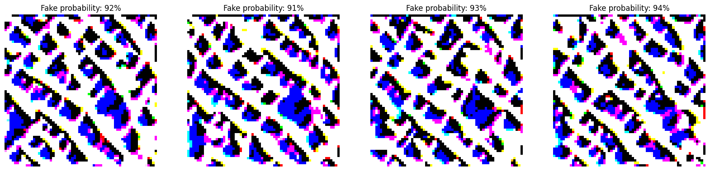
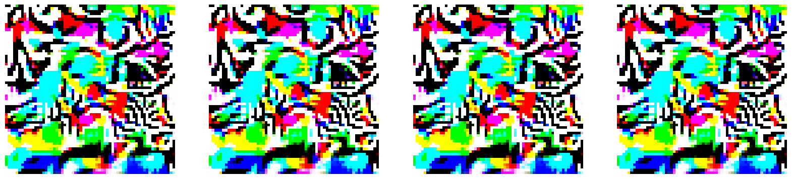
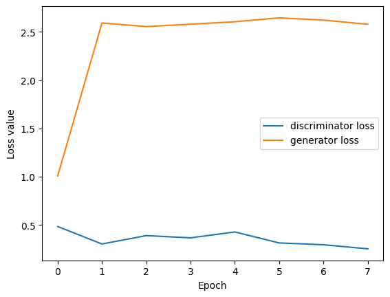
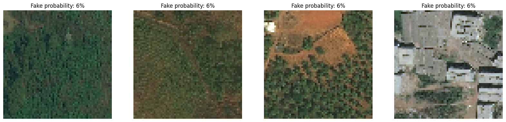

# GAN for Satellite Image Generation

## Overview
As pointless as it seems, not satisfied with the results on the real world data, the idea was to train a GAN on the satellite photos. The limited resources made it even more unachievable. However we some of the results are  nice to look at

## Results

### No Transfer Learning Model
The GAN trained without transfer learning produced the following results:

Not really looking like earth surface, and all consistent (overfitting?).

### Transfer Learning Model
Not even knowing if it makes sense the incorporating transfer learning using a ResNet50 backbone, gave this images:

Even more psychedelic. 

### The potential problem
Train a GAN is always about balancing the discriminator and generator training speed to keep the game of guessing competitive but fair. Despite decreasing the discriminator learning rate it always seem to be to good for the generator

At least we got a dissent discriminator.

