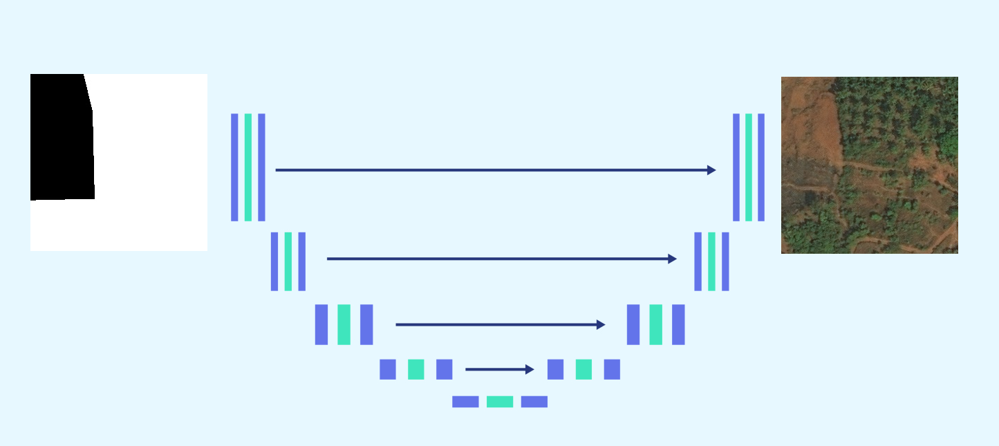
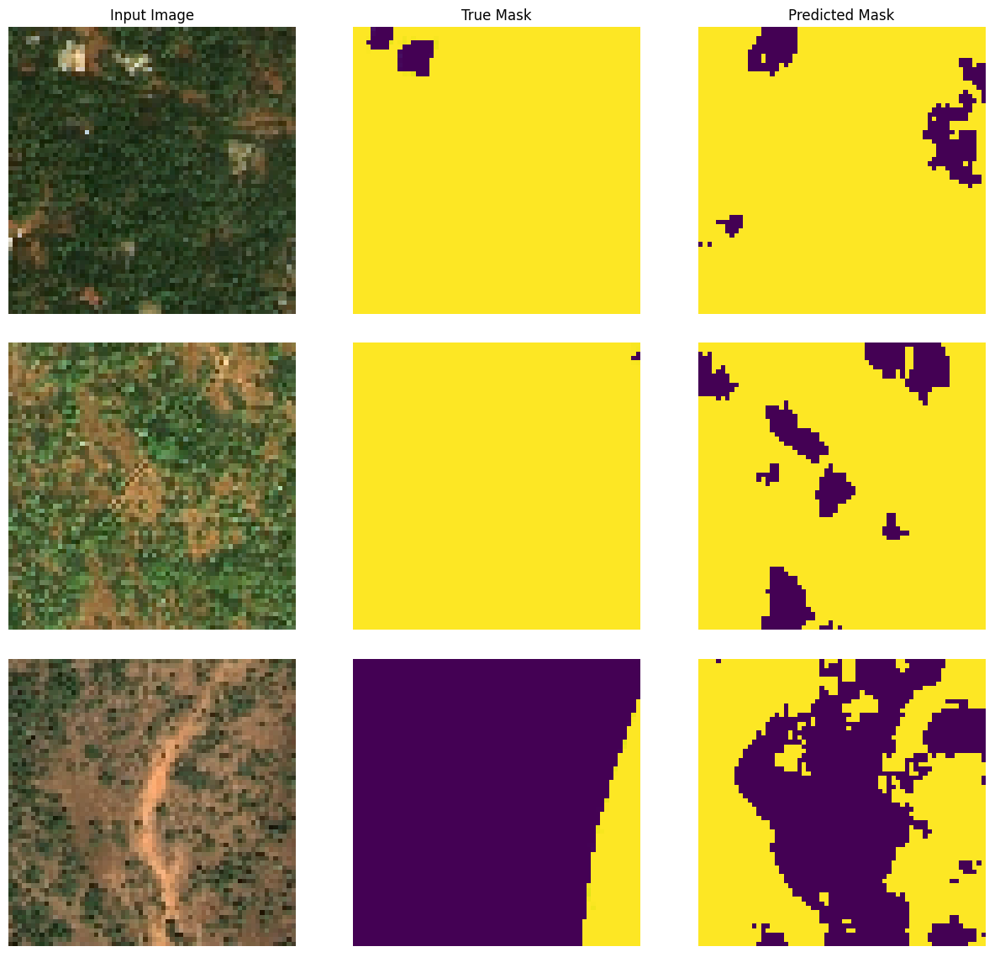
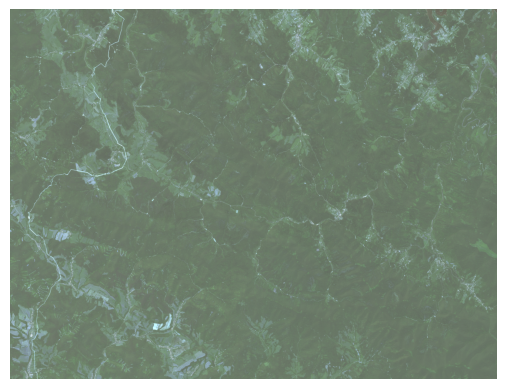
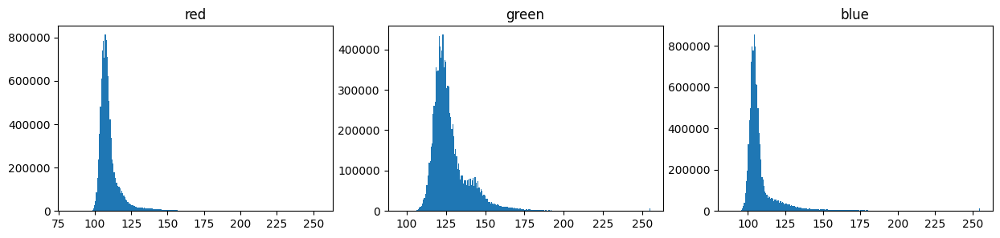
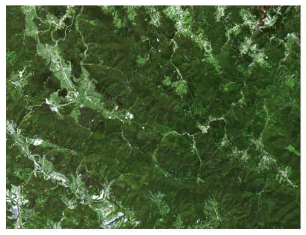
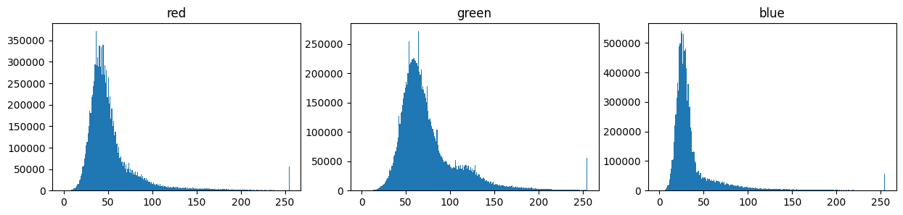

# Deforestation Detection in Puszcza Karpacka using Image Segmentation

Deforestation is one of the major environmental concerns that the world is facing today. Deforestation leads to the loss of biodiversity, soil erosion, and climate change. Therefore, there is an urgent need to monitor and detect deforestation using various methods. In this project, we will be using the method of image segmentation for satellite photos to detect deforestation in the terrain of [Puszcza Karpacka](https://pl.wikipedia.org/wiki/Puszcza_Karpacka).

For a full project description check the [report](https://github.com/janfiszer/deforestation-in-Poland/blob/main/report.pdf).

## Image Segmentation Concept

Image segmentation is the process of dividing an image into multiple segments or regions, each of which corresponds to a different object or part of the image. It is a fundamental task in computer vision, and it has various applications such as object detection, medical imaging, and remote sensing.

For this project, we will be using the U-Net architecture for image segmentation. U-Net is a convolutional neural network architecture that is commonly used for biomedical image segmentation. It has a contracting path that captures the context and a symmetric expanding path that enables precise localization.

## External Dataset

We will be using an external [dataset](https://www.kaggle.com/datasets/quadeer15sh/augmented-forest-segmentation/code) from Kaggle to train our image segmentation model to detect deforestation in the terrain of Puszcza Karpacka. This dataset was obtained from Land Cover Classification Track in DeepGlobe Challenge. For more details on the dataset refer the related publication - [DeepGlobe 2018: A Challenge to Parse the Earth through Satellite Images](https://arxiv.org/pdf/1805.06561.pdf). The images in the dataset were patched into images of size 256x256 to create more number of image samples.

### Training results

The training yields a model that performs satisfactorily on the test data. The ground truth labels weren't assigned ideally (see the image), however by keeping the right balance in the training (careful for overfitting) the model was detecting the forest more accurately than the ground truth labels. 

## Sentinel-2 Imagery

Sentinel-2 is a European satellite mission developed by the European Space Agency (ESA) in collaboration with the European Commission. It is part of the Copernicus program, which aims to provide accurate, timely, and easily accessible information to improve the management of the environment, understand and mitigate the effects of climate change, and ensure civil security.

In this project, we will be using Sentinel-2 imagery of the Puszcza Karpacka forest in Poland. The U-Net architecture trained on the external [dataset from Kaggle](https://www.kaggle.com/datasets/quadeer15sh/augmented-forest-segmentation/code) will be applied to the Sentinel-2 photos to detect deforestation in the terrain of Puszcza Karpacka. 

## Applying the trained model on the Sentinel-2 Images

The images had to histogram-stretch, because they were *bleached*. 

Its histogram for each color:

After this processing image got more vivid colors (alike to the training dataset):

The transformed dataset:

### A failure
Despite different approaches the forest segmentation of the Sentinel-2 Images of Puszcza Karpacka didn't work.

The potential reasons and applicable solution are described deeply in the [report](https://github.com/janfiszer/deforestation-in-Poland/blob/main/report.pdf).      

## Note
The external dataset from Kaggle will be used for training the model, while the Sentinel-2 imagery will be used for testing the model's performance on real-world data.